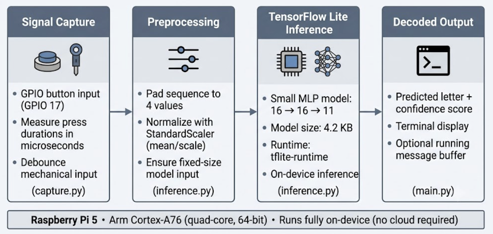

# Decoding Morse Code with a Neural Network on Raspberry Pi 5

A small, complete Edge AI project: press a button in Morse code, and a neural
network running on the Pi tells you which letter you tapped. No cloud, no GPU,
no internet round-trip. The model is 4.2 KB and the whole inference path fits in
a few microseconds of compute.

This started life as an [Arm workshop on an STM32 microcontroller](https://github.com/obedbabington/tiny-ml-morse-decoder)
(built at Ashesi University). This repository is the Raspberry Pi 5 port. It
trades the microcontroller's bare-metal constraints for a Linux board and
TensorFlow Lite, which makes it a much easier place to *learn* how an end-to-end
Edge AI workflow actually fits together.

If you have never shipped a model onto real hardware before, this is meant to be
your first one. It is deliberately tiny, so nothing important is hidden behind a
framework.

**Tested on:** Raspberry Pi 5, 64-bit Raspberry Pi OS (the code also runs on Pi 4 / Pi 3).

## Demo

[](https://youtu.be/0DMIoF-qInE)

*Real-time Morse decoding on a Raspberry Pi 5 with a single push button.*

---

## What you'll learn

This is a tutorial as much as a project. By the end you will have walked through
the same loop you'd use for any small Edge AI application:

1. **Capture a signal** from a physical sensor (here, a GPIO button).
2. **Turn raw signals into features** the model understands (timing in microseconds).
3. **Train a small classifier** in TensorFlow/Keras on a laptop or Colab.
4. **Convert it to TensorFlow Lite** and shrink it for the edge.
5. **Run inference on-device** with `tflite-runtime` and read the result.

The Morse problem is the excuse; the workflow is the point. Once you've done it
for button taps, swapping in an accelerometer, a microphone, or a current sensor
is mostly a data problem, not a new engineering problem.

## Why Morse code is a good first Edge AI problem

Morse is almost the simplest "real" signal you can classify:

- **The input is tiny and interpretable.** Each character is at most four button
  presses, so a sample is just four numbers (press durations). You can read the
  raw data and sanity-check the model by eye.
- **It's genuinely temporal.** A dot and a dash differ only in *duration*, which
  forces you to think about timing, sampling, and noise: the same concerns you'd
  have with vibration or audio, just slower and easier to debug.
- **You can generate your own dataset in minutes** by pressing a button, so you
  own the full pipeline from data collection to deployment.
- **It fails in instructive ways.** Hold the button a beat too long and a dot
  becomes a dash. That ambiguity is exactly why a learned model is more forgiving
  than a hand-tuned threshold, and it's a good lesson in why we reach for ML at
  all.

It is *not* a flagship industrial application, and this README won't pretend it
is. It's a clean teaching example for the pattern that powers real Edge AI.

---

## The architecture

The system is a four-stage pipeline. Each stage maps to one source file, which
makes it easy to test and reason about each piece in isolation.



```
  Signal Capture        Preprocessing        TFLite Inference        Decoded Output
  (capture.py)          (inference.py)       (inference.py)          (main.py)
  ───────────────       ───────────────      ─────────────────       ───────────────
  GPIO 17 button   ──>  pad to 4 values  ──> 16→16→11 MLP       ──>  letter + confidence
  press durations       StandardScaler       tflite-runtime          printed to terminal
  in microseconds       normalization        (~4.2 KB model)
```

Everything above runs **on the Pi itself**. The training step (below) happens
once, off-device.

| Stage | File | Responsibility |
|-------|------|----------------|
| Signal capture | `capture.py` | Time button presses with `perf_counter_ns`, debounce, detect end-of-character |
| Preprocessing | `inference.py` | Pad to 4 values, apply the same `StandardScaler` used in training |
| Inference | `inference.py` | Run the TFLite interpreter, return the top class + confidence |
| Orchestration / output | `main.py` | Wire capture → inference, print results, hold session state |

---

## Hardware

You need almost nothing:

- A **Raspberry Pi 5** (Pi 4 / Pi 3 work too).
- One **tactile push button** (a momentary switch).
- Two **jumper wires**.

### Wiring

Connect the button between GPIO 17 and ground. No resistor required; the code
enables the Pi's *internal* pull-up.

| Button terminal | Pi physical pin | Pi function | Role |
|-----------------|-----------------|-------------|------|
| Terminal 1 | Pin 11 | GPIO 17 (BCM) | Signal in |
| Terminal 2 | Pin 9  | GND          | Ground   |

With the internal pull-up enabled, GPIO 17 reads **HIGH** when the button is
open and **LOW** when you press it (the button shorts the pin to ground). The
capture code measures how long it stays LOW. That duration is the whole signal.

---

## Quick start

```bash
git clone https://github.com/obedbabington/tiny-ml-morse-decoder-rpi5.git
cd tiny-ml-morse-decoder-rpi5
chmod +x setup_pi.sh
./setup_pi.sh
```

`setup_pi.sh` installs system packages, builds a Python 3.11 virtual environment
(needed for `tflite-runtime` wheels), installs the Python dependencies, and adds
your user to the `gpio` group. If it adds you to `gpio`, log out and back in once
so the permission takes effect.

Then run it:

```bash
source ~/morseai_venv/bin/activate
python main.py
```

Press the button, tap out a letter, wait two seconds, and the predicted
character appears.

---

## How it works, stage by stage

### 1. Capturing the signal (`capture.py`)

The button is read with [`gpiozero`](https://gpiozero.readthedocs.io/), which
fires callbacks on press and release from a background thread. On each press we
record the start time; on each release we compute the duration in microseconds:

```python
def _get_time_us(self) -> float:
    # nanosecond clock, converted to microseconds
    return time.perf_counter_ns() / 1000.0
```

`perf_counter_ns()` is a monotonic, high-resolution clock: the right tool when
you're measuring elapsed time and don't want the wall clock jumping under you.

Two details matter more than they look:

- **Debounce.** Mechanical buttons "chatter"; a single physical press can
  register as several electrical transitions. `gpiozero`'s `bounce_time=0.05`
  (50 ms) filters that out so one press is one event.
- **End-of-character timeout.** How does the program know you've *finished* a
  letter? It doesn't, until you stop. After each release we arm a 2-second timer;
  if you press again it's cancelled, and if it fires we treat the collected
  presses as one complete character. This is a small state machine, and writing
  it is a good reminder that "real-time" capture is mostly about timing and edge
  cases, not the model.

Each character is stored as up to four durations and **padded with zeros** to a
fixed length of four, because the model always expects exactly four inputs.

You can run this stage on its own to verify wiring and timing:

```bash
python capture.py   # prints raw durations as you press the button
```

### 2. The dataset

The dataset (`training/morse_code_data.csv`) is 450 hand-collected samples
covering the letters **A–J**. Each row is four timing values (microseconds) plus
the letter:

```
101536,658230,0,0,A      # A = dot, dash  → short press, long press, then padding
447872,138585,549335,133193,C
```

A few honest notes about the data:

- It's **small and slightly imbalanced** (35–50 samples per letter). That's fine
  for a 10-class toy problem, but it's the first thing I'd grow to improve
  robustness.
- The timings are *yours*. Everyone taps Morse a little differently, so a model
  trained on one person's rhythm will work best for that person. Collecting your
  own data is part of the exercise.

### 3. The model

The classifier is a deliberately small feed-forward network (`training/MorseAI_RPi_Notebook.ipynb`):

```python
model = tf.keras.Sequential([
    tf.keras.layers.Dense(16, activation='relu', input_shape=(4,)),
    tf.keras.layers.Dense(16, activation='relu'),
    tf.keras.layers.Dense(11, activation='softmax')  # A–J + "unclassified"
])
```

Design choices worth calling out:

- **Why so small?** Four inputs and ten classes do not need depth. Two 16-unit
  hidden layers are plenty, and a tiny model converts cleanly to TFLite and
  leaves almost no memory footprint. Bigger would only overfit 450 samples.
- **The 11th class is "unclassified" (`U`).** During training we add ~10% random
  noise vectors labelled `U`. This teaches the model to say *"I don't know"*
  instead of confidently mapping garbage to the nearest letter, a small trick
  that makes the deployed system feel far less brittle.
- **Inputs are standardized.** Raw durations are tens to hundreds of thousands of
  microseconds. A `StandardScaler` (subtract mean, divide by standard deviation)
  brings them to a sane range so training converges quickly. **The exact same
  mean and scale must be applied at inference time**. Get this wrong and the
  model sees data it was never trained on. That's why the scaler parameters are
  exported alongside the model.

### 4. Training and TFLite conversion

Training is unremarkable on purpose: Adam, sparse categorical cross-entropy, and
early stopping on validation loss so it doesn't overfit. The interesting part for
an Edge AI tutorial is the conversion:

```python
converter = tf.lite.TFLiteConverter.from_keras_model(classifier.model)
converter.optimizations = [tf.lite.Optimize.DEFAULT]   # weight quantization
tflite_model = converter.convert()
```

The notebook exports two artifacts into `model/`:

- `morse_classifier.tflite`: the model itself (**4,276 bytes**).
- `normalization_config.npz`: the `StandardScaler` mean and scale, so inference
  applies *exactly* the transform used in training.

Keeping the normalization parameters next to the model is the kind of detail
that separates a demo that works on your machine from one that works on someone
else's.

### 5. Inference on the Pi (`inference.py`)

On-device we use **`tflite-runtime`**, not full TensorFlow. The runtime is a few
megabytes instead of hundreds, starts fast, and is all you need to *run* a model:

```python
import tflite_runtime.interpreter as tflite

interpreter = tflite.Interpreter(model_path=..., num_threads=4)
interpreter.allocate_tensors()
```

A prediction is: normalize → set tensor → `invoke()` → read the softmax output →
take the argmax. The engine also reports how long `invoke()` took, which is what
you'll see in the performance section.

Test this stage in isolation too. It runs known patterns through the model
without touching the GPIO:

```bash
python inference.py
```

---

## Using the decoder

1. **Press and hold** the button to make a signal.
2. **Release** to end it.
3. **Short press** (~100 ms) = dot (·); **long press** (~300 ms+) = dash (−).
4. **Wait ~2 seconds** to submit the character.
5. The predicted letter, with a confidence score, prints to the terminal.

### Morse reference (A–J)

| Letter | Code | Pattern |
|--------|------|---------|
| A | ·−   | short, long |
| B | −··· | long, short, short, short |
| C | −·−· | long, short, long, short |
| D | −··  | long, short, short |
| E | ·    | short |
| F | ··−· | short, short, long, short |
| G | −−·  | long, long, short |
| H | ···· | short, short, short, short |
| I | ··   | short, short |
| J | ·−−− | short, long, long, long |

### Command-line options

```bash
python main.py [OPTIONS]

  -g, --gpio PIN      GPIO pin for the button (default: 17)
  -m, --model PATH    Path to the .tflite model
  -c, --config PATH   Path to the normalization .npz
  -d, --debug         Print raw timings and intermediate state
  -v, --version       Show version
  -h, --help          Show help
```

```bash
python main.py --gpio 27        # use a different pin
python main.py --debug          # see the raw durations the model receives
```

---

## Performance on Raspberry Pi 5

Edge AI lives or dies on resource cost. The table below lists measured results
from a **Raspberry Pi 5** running `benchmark.py` (10,000 iterations, 4 threads,
200 warmup). TFLite loads the **XNNPACK** CPU delegate automatically.

| Metric | Value | How it's measured |
|--------|-------|-------------------|
| Model size (on disk) | **4.18 KB** (4,276 bytes) | `ls -l model/morse_classifier.tflite` |
| Input / output | 4 × float32 in → 11 × float32 out | model signature |
| Inference latency (median) | **3.0 µs** | `benchmark.py`, warm `invoke()` calls |
| Inference latency (mean / p95) | **3.1 / 3.1 µs** | same run |
| Inference latency (min / max) | **3.0 / 79.8 µs** | same run (max is an occasional outlier) |
| Throughput | **~280,400 inferences/s** | tight loop, 4 threads |
| Interpreter memory (RSS Δ) | **2.7 MiB** | 39.5 MiB before load → 42.2 MiB after |
| Process RSS after load | **42.2 MiB** | `/proc` resident set size |
| CPU during benchmark loop | **100%** | process CPU time ÷ wall time (see note below) |

The latency numbers are far below one millisecond. In normal use with `main.py`,
the bottleneck is the **2-second character timeout**, not inference. A 4 KB model
leaves large headroom for bigger networks and real sensors.

**Note on CPU:** The benchmark runs a tight loop with no idle time between calls.
**100%** here means the process kept one core busy for essentially the entire
timed section. It does **not** mean all four Pi cores were saturated, and it is
not representative of CPU use while waiting for button input.

### Benchmarking inference (`benchmark.py`)

`benchmark.py` loads the TFLite model and runs repeated inferences without touching
GPIO. Use it after setup to confirm the model loads and to reproduce the numbers
above, or to compare thread counts (`-t 1`, `-t 2`, `-t 4`).

```bash
source ~/morseai_venv/bin/activate
python benchmark.py              # 10000 iterations, 4 threads
python benchmark.py -n 50000 -t 2
```

---

## Challenges and lessons learned

A few things that were not obvious going in:

- **The hard part is the signal, not the network.** I spent far more time on
  debounce, the end-of-character timeout, and padding than on the model. That's
  typical for Edge AI: capturing clean, consistently-shaped data is most of the
  work.
- **Normalization is a deployment concern, not just a training one.** Forgetting
  to ship the scaler, or shipping the wrong values, produces a model that
  "loads fine" and predicts nonsense. Exporting `normalization_config.npz`
  alongside the model is the fix.
- **An explicit "I don't know" class is worth the effort.** Without the `U`
  class, a stray double-tap confidently becomes a wrong letter. With it, the
  system degrades gracefully.
- **`tflite-runtime` vs. TensorFlow is a real decision.** Installing full
  TensorFlow on a Pi is slow and heavy; the runtime is the right call for
  inference-only deployment and dictated the Python 3.11 setup.
- **Threads don't always help tiny models.** Four threads is the default, but for
  a model this small the per-call overhead can dominate. `benchmark.py` lets you
  compare `-t 1`, `-t 2`, and `-t 4` and pick what's actually fastest.

---

## From Morse to real workloads

The reason this project is worth your time is that the pipeline doesn't change
when the problem gets serious. Swap the button for a different sensor, retrain on
the new data, redeploy the same way. The four stages stay the same:

> **capture → preprocess → TFLite inference → act on the result**

Some directions that reuse this skeleton almost verbatim:

- **Sensor classification.** Replace the button with an accelerometer or
  environmental sensor and classify states (e.g. *idle / walking / running*).
  Same fixed-length feature vector, same MLP shape.
- **Predictive maintenance & vibration monitoring.** Read a vibration sensor,
  window the signal, and flag "normal vs. developing fault" on a machine.
  Time-series in, classification out.
- **Gesture recognition.** Feed IMU data from a wearable and recognise simple
  gestures. The "variable-length input, fixed-length feature" trick from Morse
  carries straight over.
- **Anomaly detection.** Instead of naming a class, learn what *normal* looks
  like and raise a flag when input drifts away from it (the `U`/unclassified
  idea, taken further.
- **Other IoT edge workloads.** Keyword spotting, occupancy sensing, simple
  fault detection: anything where you want a decision *at the sensor* without a
  round-trip to the cloud, for latency, privacy, or connectivity reasons.

The step up from here is usually (a) more / better data, (b) a slightly larger
model, and (c) windowing a continuous stream instead of discrete button presses.
None of those change the deployment story.

---

## STM32 vs. Raspberry Pi 5: two faces of Edge AI

This project exists on both an STM32 microcontroller and a Raspberry Pi 5, which
makes it a nice side-by-side for two very different points on the Edge AI
spectrum. Neither is "better"; they answer different questions.

| Dimension | STM32 (microcontroller) | Raspberry Pi 5 (Linux SBC) |
|-----------|-------------------------|----------------------------|
| **Developer experience** | Bare-metal / RTOS, C/C++, flash-and-debug cycle | Full Linux, Python, edit-and-run |
| **Toolchain** | TFLite Micro, C compiler, vendor IDE, model embedded as a C array | TensorFlow → TFLite, `tflite-runtime`, pip/venv |
| **Deployment workflow** | Cross-compile, flash firmware over SWD/USB | `git pull` and run a script |
| **Compute & memory** | ~Hundreds of KB RAM, MHz-class core, no OS | GB of RAM, GHz-class quad Cortex-A76, full OS |
| **Iteration speed** | Slow: recompile + reflash to try a change | Fast: change a line, rerun in seconds |
| **Power & cost** | Milliwatts, cents-to-dollars | Watts, tens of dollars |
| **Best for** | Always-on, battery, cost-sensitive, real-time | Prototyping, heavier models, learning, gateways |

In plain terms:

- **Learn and prototype on the Pi.** The fast edit-run loop, real Python, and
  generous resources mean you spend your time on the *problem*, not on toolchain
  friction. This is why the port exists.
- **Ship to the STM32 when constraints bite.** When you need microwatts, a unit
  cost in cents, or hard real-time guarantees, the microcontroller is the right
  home, and TFLite Micro lets you take essentially the same model there.

A realistic workflow is to do both: develop and validate the model on the Pi,
then port the proven model down to the MCU for production. The Pi is the
workshop; the STM32 is the finished product.

---

## Project structure

```
MorseAI_RPi5/
├── main.py                 # Orchestrates capture → inference, CLI, output
├── capture.py              # GPIO timing capture (state machine)
├── inference.py            # TFLite inference engine + normalization
├── benchmark.py            # Measure latency / memory / CPU on-device
├── requirements.txt        # Python dependencies (pinned)
├── setup_pi.sh             # One-shot Pi setup
├── docs/
│   ├── architecture.png    # Pipeline diagram (generated)
│   └── make_diagram.py     # Regenerate the diagram
├── training/
│   ├── MorseAI_RPi_Notebook.ipynb   # Train + convert to TFLite
│   └── morse_code_data.csv          # 450 labelled samples (A–J)
└── model/
    ├── morse_classifier.tflite      # 4.2 KB model
    └── normalization_config.npz     # Scaler mean/scale
```

## Testing the pieces independently

Each stage is runnable on its own, which is the fastest way to localise a
problem:

```bash
python capture.py     # is the wiring/timing right?  (needs the Pi + button)
python inference.py   # does the model load and predict known inputs correctly?
python benchmark.py   # how fast/heavy is inference on this board?
```

## Troubleshooting

- **`capture.py` doesn't react to presses.** You were probably added to the
  `gpio` group during setup; log out and back in. Then re-check wiring: GPIO 17
  (pin 11) ↔ button ↔ GND (pin 9).
- **Every letter comes back as `U`.** Almost always a normalization mismatch;
  make sure `model/normalization_config.npz` matches the model you trained.
- **`tflite_runtime` import fails.** Use the Python 3.11 venv created by
  `setup_pi.sh`; the wheels aren't available for every Python version.
- **Dots read as dashes (or vice versa).** Your timing differs from the training
  data. Run with `--debug` to see the raw durations, and consider collecting a
  few of your own samples and retraining.

## Roadmap / future work

- Grow and balance the dataset; support full A–Z and digits.
- Decode whole *words* (inter-character and inter-word gaps), not single letters.
- Add an integer-quantized (`int8`) variant and compare accuracy vs. size.
- Provide a matching TFLite Micro build notes file for the STM32 target.

## Acknowledgments

- Original STM32 implementation: [tiny-ml-morse-decoder](https://github.com/obedbabington/tiny-ml-morse-decoder)
, an Arm workshop project at Ashesi University, which this Raspberry Pi 5 port
  is based on.

## Contributing

Issues and pull requests are welcome, especially measured benchmarks from
different Pi models, more training data, and A–Z support. Fork, branch, commit,
and open a PR.
